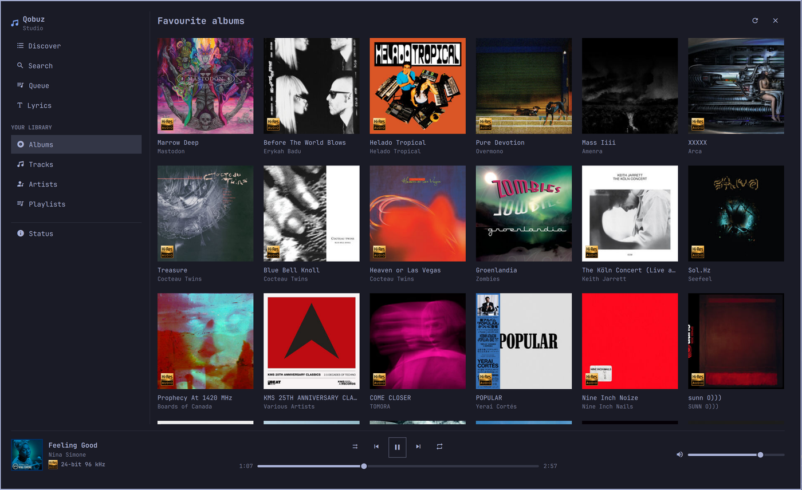
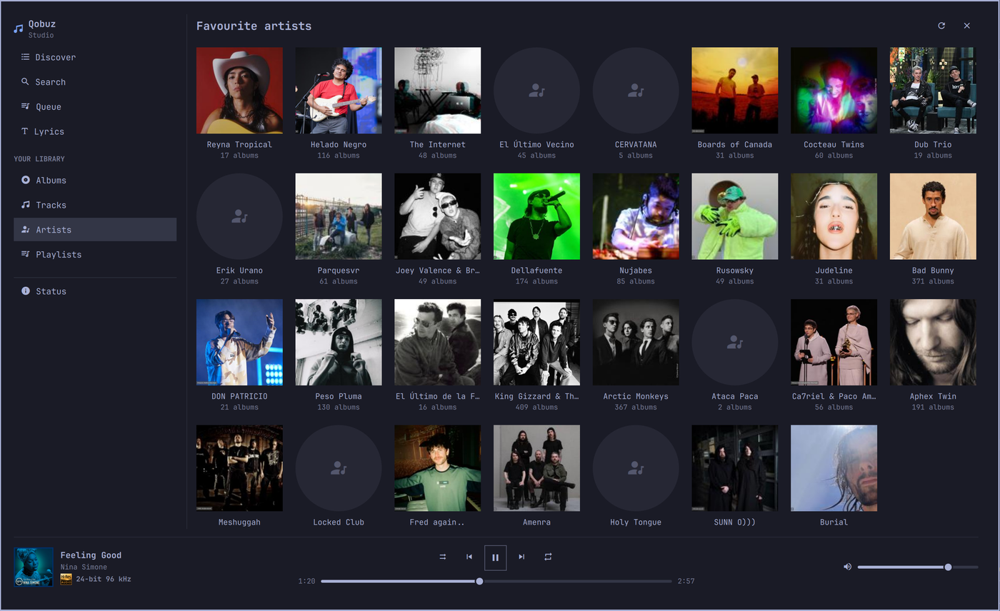
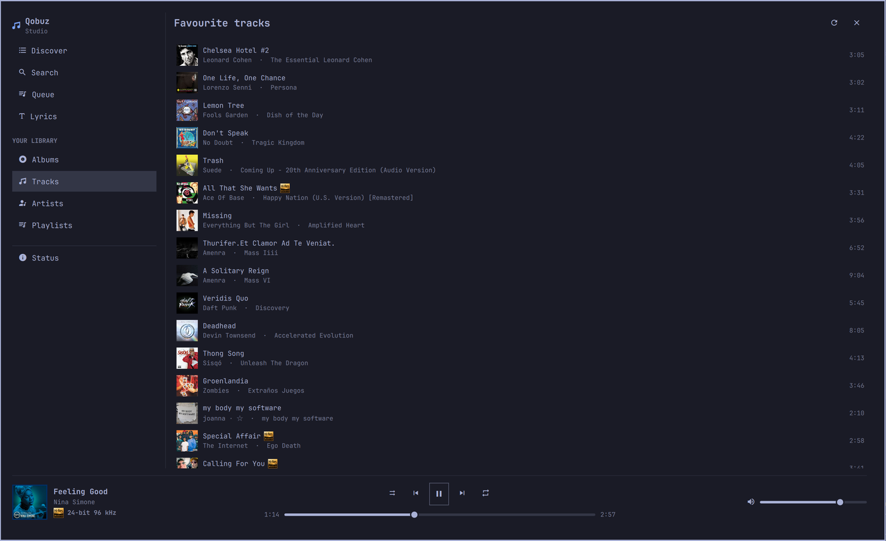
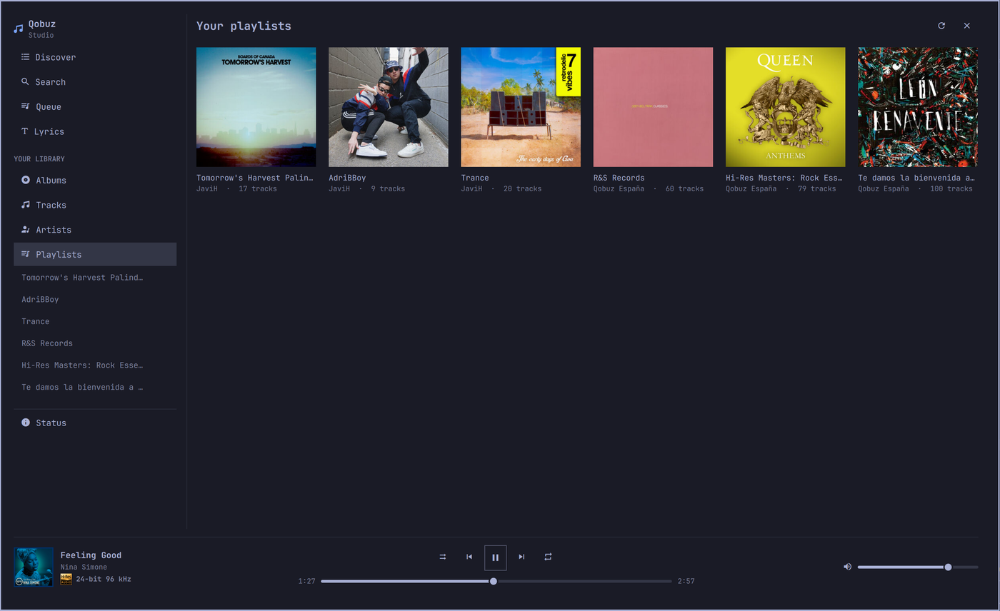
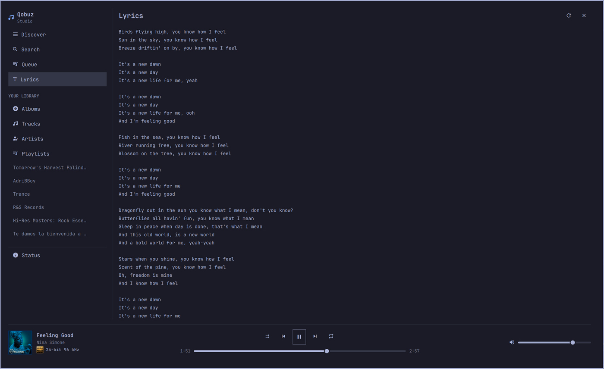

# Qobuz for Omarchy

Your Qobuz subscription on the Omarchy bar, with a full-screen player behind it.


**In the bar:** the track, next to the clock. Click for transport and what's up
next, middle-click to play/pause, scroll to change the volume.

**Behind it:** your albums, tracks, artists and playlists in cover grids;
search; album and artist pages; Qobuz's own discover rails; and lyrics.

Playback is [`qbzd`](https://github.com/vicrodh/qbz), a headless daemon that
holds the Qobuz session — the relationship Omarchy's Spotify plugin has with
`spotifyd`. Qobuz has no public third-party API (partner credentials come from
`api@qobuz.com`), so nothing here talks to Qobuz directly. Nothing is bundled
and nothing is downloaded at runtime.

You need an active Qobuz subscription, `qbzd` 2.0.2 or newer, and Omarchy
4.0.0.alpha or newer (Quickshell 0.3.1). `curl`, `jq` and `bash` do the I/O and
are already on any Omarchy box.

## Install

### 1. The daemon

`qbzd` ships only as a standalone tarball in the qbz releases — the AUR's
`qbz-bin` installs the desktop GUI and nothing else — so there is a PKGBUILD
here for it:

```bash
git clone https://github.com/alteredeg0/omarchy-qobuz /tmp/omarchy-qobuz
cd /tmp/omarchy-qobuz/packaging
BUILDDIR=/tmp/qbzd-build SRCDEST=/tmp/qbzd-build PKGDEST=/tmp/qbzd-build makepkg -si
```

Those three variables keep `src/`, `pkg/` and the tarball out of the checkout;
without them makepkg leaves symlinks behind that `omarchy plugin validate`
rejects. You get `/usr/bin/qbzd`, the upstream systemd **user** unit and shell
completions. Then log in and start it:

```bash
qbzd setup                       # six screens; the first is the browser OAuth
systemctl --user enable --now qbzd
```

> **Check the bind address.** qbzd listens on `0.0.0.0:8182` out of the box, so
> anyone on your network can drive your player. Unless that is what you want:
>
> ```toml
> # ~/.config/qbzd/qbzd.toml
> [server]
> bind = "127.0.0.1"
> ```
>
> A `token` in the same section is honoured by this plugin too.

### 2. The plugin

```bash
omarchy plugin add https://github.com/alteredeg0/omarchy-qobuz --enable
```

Or by hand:

```bash
git clone https://github.com/alteredeg0/omarchy-qobuz ~/.config/omarchy/plugins/javih.qobuz
omarchy-shell shell rescanPlugins
omarchy plugin enable javih.qobuz right
```

A key for the app, if you want one, in `~/.config/hypr/bindings.lua`:

```lua
o.bind("SUPER, M", "Qobuz", "omarchy-shell shell toggle javih.qobuz")
```

## A look around

Your library, in the four shapes Qobuz keeps it in:

| Albums | Artists |
|---|---|
|  |  |

| Tracks | Playlists |
|---|---|
|  |  |

Search the whole catalogue, open any artist, read along:

| Search | An artist page | Lyrics |
|---|---|---|
|  |  |  |


### Without leaving the bar

Clicking the widget drops the panel: the cover, what is playing and at what
quality, a seek bar, transport, volume, and the queue underneath — enough to
skip a track without opening anything. **Open Qobuz** takes you to the app when
you want the rest.

Tracks Qobuz reports as hi-res carry the Japan Audio Society **Hi-Res AUDIO**
mark, here and everywhere else they appear.

<br clear="all">

## Keys and gestures

| Where | |
|---|---|
| **Bar** | Left click opens the panel · middle click plays/pauses · scroll changes the volume |
| **Panel** | `Space` play/pause · `←` `→` previous/next · `s` shuffle · `l` repeat · `r` refresh · `o` open the app · `Esc` close |
| **App** | `/` search · `Space` play/pause · `←` `→` previous/next · `Esc` backs out of a page, then closes. Clicking outside closes it. |
| **Any list** | Left click **opens** an album, artist or playlist and **plays** a track; right click does the other one. Hovering a row says which. |

`omarchy-shell shell toggle javih.qobuz` opens the app;
`omarchy-shell javih.qobuz toggle` opens the panel. Media keys need no setup —
qbzd publishes MPRIS as `org.mpris.MediaPlayer2.com.blitzfc.qbz`, which
Omarchy's own bindings already drive.

<details>
<summary><b>Scripting it</b> — the full IPC surface</summary>

<br>

`omarchy-shell javih.qobuz {open,close,toggle,refresh,status}` drives the panel.
These three open the app at a spot:

```bash
omarchy-shell javih.qobuz search "kind of blue"
omarchy-shell javih.qobuz view queue|search|library|discover|lyrics
omarchy-shell javih.qobuz browse album|artist|playlist <id>
```

`results` prints the current search back as text.

Declaring the `overlay` kind alongside `bar-widget` is what routes
`shell toggle` to the app rather than to the bar popup — see
`isBarWidgetPanelPlugin` in Omarchy's `shell.qml`. The panel keeps its own
`IpcHandler`, which never went through that route.

</details>

## Settings

Set with `omarchy bar set javih.qobuz <key> <value>`.

| Key | Default | What it does |
|---|---|---|
| `host` | `127.0.0.1:8182` | qbzd control API. Point it at another machine to drive a remote player. |
| `showLabel` | `true` | Off leaves just the play/pause glyph. A vertical bar always collapses to the glyph. |
| `maxLabelChars` | `32` | Elision point for the bar label. |
| `hideWhenIdle` | `false` | Collapse the widget out of the bar while qbzd is stopped. |
| `language` | `auto` | UI language: `auto`, `en` or `es`. `auto` follows `$LANG` and falls back to English. |

The language setting reaches only the plugin's own words. Catalogue text arrives
in whatever language Qobuz serves the account — playlist names, an artist's
`performer` category, "Qobuz España" as a playlist owner.

<details>
<summary><b>How it works</b> — one service, two surfaces, and why it polls</summary>

<br>

`QobuzService.qml` is a `service`-kind singleton. The bar instantiates widgets
once *per monitor*, so the daemon connection and the state live there rather
than in the widget, which reaches it with
`bar.shell.serviceFor("javih.qobuz")`. The app gets the same instance handed to
it by the shell's panel loader (`item.service = shell.serviceFor(pluginId)`), so
both surfaces share one session with no state to reconcile.

Two shell helpers do all the I/O, because qbzd answers **403 to any request
carrying an `Origin` header** (its CSRF guard) and QML's `XMLHttpRequest` sends
one:

- `bin/qbzd-api` — one request, one line of JSON, qbzd's exit codes preserved
  (`3` unreachable, `4` needs auth).
- `bin/qbzd-events` — the event stream as newline-delimited JSON.

State comes from **polling `/api/status`**, with the event stream only as an
accelerator. That is deliberate: on qbzd 2.0.2 `/api/events` emits nothing at
all — not even HTTP response headers — even during active playback, so an idle
stream and a dead one are indistinguishable. `/api/status` also answers while
logged out, which is what lets the UI tell "daemon down" from "not logged in".
The poll backs off from 1 s while playing to 15 s while unreachable.

Cover art needs a detour: qbzd leaves a track's `artwork_url` null and its
`album` set to `"Unknown Album"` when the track was queued from an album id, and
`/api/artwork/current` 404s as a consequence. The track does carry
`context_kind`/`context_id`, so the service does one `/api/album?id=<upc>`
lookup per album and takes the cover and the real title from there.

`Model.isHiRes()` trusts qbzd's own `hires` flag first and otherwise applies the
specification's threshold: at least 24-bit **and** 96 kHz.

</details>

<details>
<summary><b>Where the qbz wiki is wrong</b> — what the fixtures actually show</summary>

<br>

`tests/fixtures/` holds verbatim responses from a live qbzd 2.0.2, with personal
fields replaced — see [`tests/fixtures/README.md`](tests/fixtures/README.md).
They are the authority over the wiki, which these captures contradict:

- `/api/queue` returns `upcoming`/`history`/`current_track`, not a flat `tracks` array.
- The previous-track route is `/api/playback/previous`; `/prev` 404s.
- `/api/playback/mute` does not exist.
- `/api/search` takes **plural** type values (`albums`, not `album`).
- `/api/play` takes a typed id — `{"album_id": "…"}`, `{"track_id": N}` — not
  the documented `{"content": "album:ID"}`.
- `/api/favorites?type=albums` answers `type: "album"` (singular) while the
  bucket it fills stays plural.

Catalogue responses also nest what the playback ones keep flat: a search track's
artist is `performer.name` (its own `artist` is null), an artist page names
itself in `name.display`, release lists nest again as `artist.name.display`,
discover albums leave `artist` null and fill `artists[]`, and an artist portrait
is `{hash, format}` rather than a URL. That is what `nameOf`, `artistsLabel` and
`artistPortraitUrl` exist for.

</details>

<details>
<summary><b>Hacking on it</b> — tests, hot reload, adding a language</summary>

<br>

```bash
node --test tests/                                     # reducer + strings
/usr/lib/qt6/bin/qmllint -I /usr/share/omarchy/shell *.qml
omarchy plugin validate .
bash -n bin/qbzd-api bin/qbzd-events
```

Saving any file under `~/.config/omarchy/plugins/` hot-reloads the plugin —
**except** the `.js` files. QML caches imported JS libraries past
`Qt.clearComponentCache()`, so changes to `QobuzModel.js` or `QobuzStrings.js`
need `omarchy restart shell`.

Every word the plugin writes lives in `QobuzStrings.js`. Adding a language means
adding one block to `STRINGS` and listing its code in `LANGUAGES`;
`tests/strings.test.js` then enforces that it has the same keys as English, none
empty, with matching `{0}` placeholders. Note that the plural rule is two-form
(`albumsCountLabel`), which suits Western European languages but not Slavic or
Arabic ones.

</details>

## Security

Omarchy plugins run **unsandboxed in the shell process, with your user
permissions**. This one runs `curl` through two bundled shell scripts and reads
`~/.config/qbzd/qbzd.toml` for an optional API token. It starts no second
Quickshell process, requires no privileges, and makes no network request other
than to the qbzd host you configure and to `static.qobuz.com` for cover art.

Read `bin/qbzd-api` and `bin/qbzd-events` before installing — they are 60 lines
between them.

The only thing it writes outside its own directory is its own entry in
`~/.config/omarchy/shell.json`, and only through `omarchy bar set`. It never
touches your Hyprland config, your theme, or anything else.

## Removal

```bash
omarchy plugin remove javih.qobuz     # its entry in shell.json, and the directory

# the keybinding, if you added one: delete the o.bind line, then
hyprctl reload

# the daemon and its data
systemctl --user disable --now qbzd
sudo pacman -Rns qbzd-bin
rm -rf ~/.config/qbzd ~/.local/share/qbzd ~/.cache/qbzd ~/.cache/qbz
```

Removing `~/.config/qbzd` also drops your Qobuz OAuth token, so keep it if you
only mean to remove the plugin.

## Third-party components

| Component | Where | Licence |
|---|---|---|
| [qbzd](https://github.com/vicrodh/qbz) | External daemon, not bundled. Packaged by `packaging/PKGBUILD`. | MIT |
| [Hi-Res AUDIO mark](https://en.wikipedia.org/wiki/File:Hi-Res_Audio_(logo).svg) | `assets/hi-res-audio.svg` | Public domain (PD-textlogo); JAS trademark |
| Cover art and catalogue text | Fetched at runtime from Qobuz | © the respective rights holders |

Wikipedia tags the Hi-Res mark **PD-textlogo** — too simple to attract
copyright, so shipping it is fine. It remains a **JAS trademark**, used here
descriptively to mark content, not to certify this software. See
[`assets/README.md`](assets/README.md).

## Licence

MIT — see [LICENSE](LICENSE).

Not affiliated with or endorsed by Qobuz, the Japan Audio Society, or the qbz
project.
