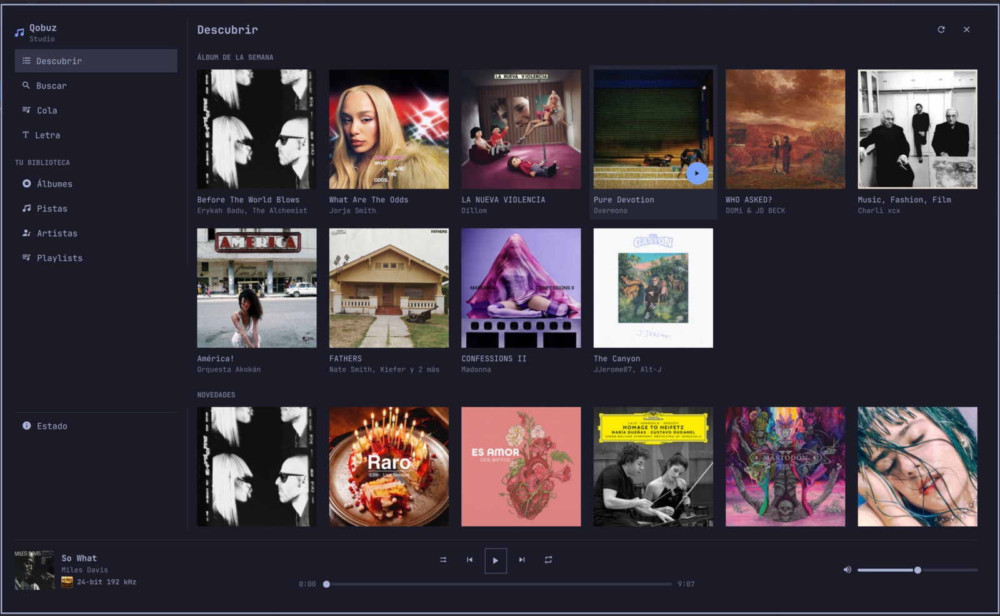
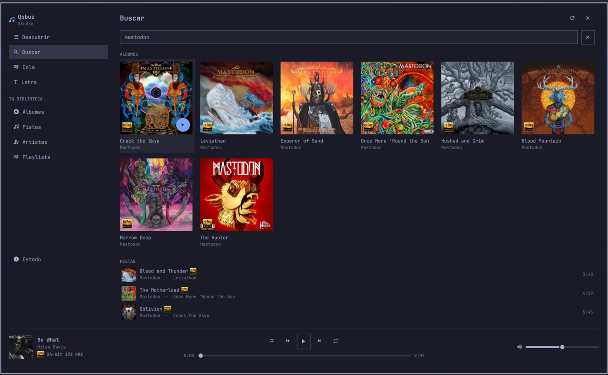
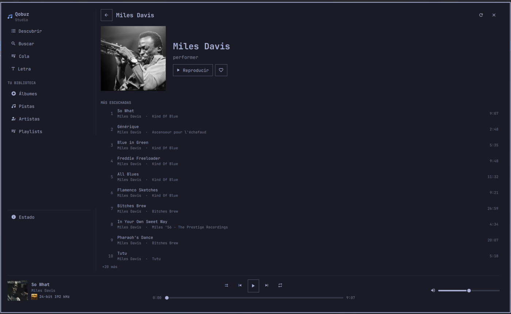
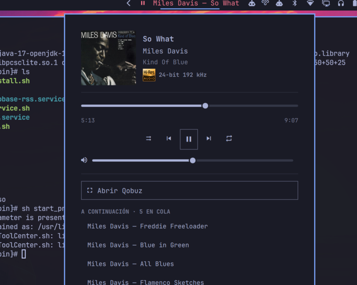

# Qobuz for Omarchy

Qobuz on the Omarchy bar and in a full-screen player, driven by the
[qbzd](https://github.com/vicrodh/qbz) headless daemon.



Two surfaces share one session:

- a **bar widget** — the current track next to the clock, with a panel for
  transport and the queue;
- a **full-screen app** — sidebar, cover grids, album/artist/playlist pages,
  search, your library, Qobuz's discover rails, lyrics and a daemon status page.

Qobuz has no public third-party API — partner credentials must be requested
from `api@qobuz.com` — so this plugin never talks to Qobuz itself. It is a
front-end for `qbzd`, which does the OAuth login and exposes a local control
API. The same relationship the Omarchy Spotify plugin has with `spotifyd`.

## Requirements

| | |
|---|---|
| Qobuz | An active subscription. |
| [`qbzd`](https://github.com/vicrodh/qbz) | 2.0.2 or newer, running and logged in. Installed separately — see below. |
| Omarchy | 4.0.0.alpha or newer (Quickshell 0.3.1). |
| Runtime | `curl`, `jq`, `bash` — all already present on Omarchy. |
| Optional | `qt6-svg` for the Hi-Res mark; already a Quickshell dependency. |

Nothing else is bundled and nothing is downloaded at runtime.

## Install

### 1. The daemon

`qbzd` ships only as a standalone tarball in the qbz releases — the AUR's
`qbz-bin` installs the desktop GUI and nothing else. A PKGBUILD is included
here for convenience:

```bash
git clone https://github.com/alteredeg0/omarchy-qobuz /tmp/omarchy-qobuz
cd /tmp/omarchy-qobuz/packaging
BUILDDIR=/tmp/qbzd-build SRCDEST=/tmp/qbzd-build PKGDEST=/tmp/qbzd-build makepkg -si
```

The three variables keep `src/`, `pkg/` and the downloaded tarball out of the
checkout — `omarchy plugin validate` rejects the symlinks makepkg would
otherwise leave behind.

That installs `/usr/bin/qbzd`, the upstream systemd **user** unit and shell
completions. Then log in and start it:

```bash
qbzd setup                       # six screens: login, audio device, name
systemctl --user enable --now qbzd
```

`qbzd setup` covers `qbzd login` (browser OAuth — there are no password
fields) as its first screen.

> **Bind address.** qbzd listens on `0.0.0.0:8182` by default, so anyone on
> your network can control playback. Unless you want that, put this in
> `~/.config/qbzd/qbzd.toml`:
>
> ```toml
> [server]
> bind = "127.0.0.1"
> ```
>
> A `token` in the same section is also honoured by this plugin.

### 2. The plugin

```bash
omarchy plugin add https://github.com/alteredeg0/omarchy-qobuz --enable
```

Or manually:

```bash
git clone https://github.com/alteredeg0/omarchy-qobuz ~/.config/omarchy/plugins/PLUGIN_ID
omarchy-shell shell rescanPlugins
omarchy plugin enable PLUGIN_ID right
```

Optionally bind the app to a key, in `~/.config/hypr/bindings.lua`:

```lua
o.bind("SUPER, M", "Qobuz", "omarchy-shell shell toggle PLUGIN_ID")
```

## Removal

```bash
# 1. The plugin
omarchy plugin remove PLUGIN_ID

# 2. The keybinding, if you added one
#    Delete the o.bind line from ~/.config/hypr/bindings.lua, then:
hyprctl reload

# 3. The daemon and its data
systemctl --user disable --now qbzd
sudo pacman -Rns qbzd-bin
rm -rf ~/.config/qbzd ~/.local/share/qbzd ~/.cache/qbzd ~/.cache/qbz
```

`omarchy plugin remove` takes the plugin's entry out of
`~/.config/omarchy/shell.json` and deletes its directory. Removing
`~/.config/qbzd` also drops your Qobuz OAuth token, so keep it if you only mean
to remove the plugin.

The plugin writes to exactly one place outside its own directory: its own entry
in `shell.json`, and only through `omarchy bar set`. It never edits your
Hyprland config, your theme, or anything else.

## What it looks like

| Search | Artist page |
|---|---|
|  |  |



The bar panel: what is playing, transport, the queue, and a button into the app.

## Settings

Set with `omarchy bar set PLUGIN_ID <key> <value>`.

| Key | Default | What it does |
|---|---|---|
| `host` | `127.0.0.1:8182` | qbzd control API. Point it at another machine to drive a remote player. |
| `showLabel` | `true` | Off leaves just the play/pause glyph. A vertical bar always collapses to the glyph. |
| `maxLabelChars` | `32` | Elision point for the bar label. |
| `hideWhenIdle` | `false` | Collapse the widget out of the bar while qbzd is stopped. |
| `language` | `auto` | UI language: `auto`, `en` or `es`. |

### Language

Every word this plugin writes lives in `QobuzStrings.js`, in English and
Spanish. `auto` follows `$LANG` and falls back to English.

What it does **not** change is catalogue text, which arrives in whatever
language Qobuz serves the account — playlist names, an artist's `performer`
category, "Qobuz España" as a playlist owner.

Adding a language means adding one block to `STRINGS` and listing its code in
`LANGUAGES`. `tests/strings.test.js` then enforces that it has the same keys as
English, none empty, with matching `{0}` placeholders. Note that the plural rule
is two-form (`albumsCountLabel`), which suits Western European languages but not
Slavic or Arabic ones.

## Using it

| Gesture | Opens |
|---|---|
| `omarchy-shell shell toggle PLUGIN_ID` | the **app** |
| Clicking the bar widget · `omarchy-shell PLUGIN_ID toggle` | the **panel** |

Declaring the `overlay` kind alongside `bar-widget` is what routes
`shell toggle` to the app rather than the bar popup — see
`isBarWidgetPanelPlugin` in Omarchy's `shell.qml`. The panel keeps its own
`IpcHandler`, which never went through that route.

**In the bar:** left click opens the panel · middle click toggles playback ·
scroll changes volume.

**In the panel:** `Space` play/pause · `←`/`→` previous/next · `s` shuffle ·
`l` repeat · `r` refresh · `o` open the app · `Esc` close.

**In the app:** `/` search · `Space` play/pause · `←`/`→` previous/next ·
`Esc` backs out of a page, then closes. Clicking outside closes it.

**In any list:** left click **opens** an album, artist or playlist and **plays**
a track; right click does the other one. Hovering a row says which.

**IPC:** `omarchy-shell PLUGIN_ID {open,close,toggle,refresh,status}` drives the
panel; `search <query>`, `view <queue|search|library|discover|lyrics>` and
`browse <album|artist|playlist> <id>` open the app at that spot. `results`
prints the current search.

Media keys need no setup: qbzd publishes MPRIS as
`org.mpris.MediaPlayer2.com.blitzfc.qbz`, which Omarchy's own media bindings
already drive.

## The Hi-Res mark

Tracks Qobuz reports as hi-res carry the official Japan Audio Society
**Hi-Res AUDIO** logo. `assets/hi-res-audio.svg` comes from
[Wikipedia](https://en.wikipedia.org/wiki/File:Hi-Res_Audio_(logo).svg), which
tags it **PD-textlogo** — too simple to attract copyright, so shipping it is
fine. It remains a **JAS trademark**, used here descriptively to mark content,
not to certify this software. See [`assets/README.md`](assets/README.md).

`Model.isHiRes()` trusts qbzd's own `hires` flag first and otherwise applies the
specification's threshold: at least 24-bit **and** 96 kHz.

## How it works

`QobuzService.qml` is a `service`-kind singleton. The bar instantiates widgets
once *per monitor*, so the daemon connection and the state live there rather
than in the widget, which reaches it with
`bar.shell.serviceFor("PLUGIN_ID")`. The app gets the same instance handed to
it by the shell's panel loader (`item.service = shell.serviceFor(pluginId)`),
so both surfaces share one session with no state to reconcile.

Two shell helpers do all the I/O, because qbzd answers **403 to any request
carrying an `Origin` header** (its CSRF guard) and QML's `XMLHttpRequest` sends
one:

- `bin/qbzd-api` — one request, one line of JSON, qbzd's exit codes preserved
  (`3` unreachable, `4` needs auth).
- `bin/qbzd-events` — the event stream as newline-delimited JSON.

State comes from **polling `/api/status`**, with the event stream only as an
accelerator. That is deliberate: on qbzd 2.0.2 `/api/events` emits nothing at
all — not even HTTP response headers — even during active playback, so an idle
stream and a dead one are indistinguishable. `/api/status` also answers while
logged out, which is what lets the UI tell "daemon down" from "not logged in".
The poll backs off from 1 s while playing to 15 s while unreachable.

Cover art needs a detour: qbzd leaves a track's `artwork_url` null and its
`album` set to `"Unknown Album"` when the track was queued from an album id,
and `/api/artwork/current` 404s as a consequence. The track does carry
`context_kind`/`context_id`, so the service does one `/api/album?id=<upc>`
lookup per album and takes the cover and the real title from there.

## Development

```bash
node --test tests/                                     # reducer + strings
/usr/lib/qt6/bin/qmllint -I /usr/share/omarchy/shell *.qml
omarchy plugin validate .
bash -n bin/qbzd-api bin/qbzd-events
```

Saving any file under `~/.config/omarchy/plugins/` hot-reloads the plugin —
**except** the `.js` files. QML caches imported JS libraries past
`Qt.clearComponentCache()`, so changes to `QobuzModel.js` or `QobuzStrings.js`
need `omarchy restart shell`.

`tests/fixtures/` holds verbatim responses from a live qbzd 2.0.2, with personal
fields replaced — see [`tests/fixtures/README.md`](tests/fixtures/README.md).
They are the authority over the qbz wiki, which is wrong in several places these
captures document:

- `/api/queue` returns `upcoming`/`history`/`current_track`, not a flat `tracks` array.
- The previous-track route is `/api/playback/previous`; `/prev` 404s.
- `/api/playback/mute` does not exist.
- `/api/search` takes **plural** type values (`albums`, not `album`).
- `/api/play` takes a typed id — `{"album_id": "…"}`, `{"track_id": N}` — not
  the documented `{"content": "album:ID"}`.
- `/api/favorites?type=albums` answers `type: "album"` (singular) while the
  bucket it fills stays plural.

Catalogue responses also nest what the playback ones keep flat: a search track's
artist is `performer.name` (its own `artist` is null), an artist page names
itself in `name.display`, release lists nest again as `artist.name.display`,
discover albums leave `artist` null and fill `artists[]`, and an artist portrait
is `{hash, format}` rather than a URL. That is what `nameOf`, `artistsLabel` and
`artistPortraitUrl` exist for.

## Security

Omarchy plugins run **unsandboxed in the shell process, with your user
permissions**. This one runs `curl` through two bundled shell scripts and reads
`~/.config/qbzd/qbzd.toml` for an optional API token. It starts no second
Quickshell process, requires no privileges, and makes no network request other
than to the qbzd host you configure and to `static.qobuz.com` for cover art.

Read `bin/qbzd-api` and `bin/qbzd-events` before installing — they are 60 lines
between them.

## Third-party components

| Component | Where | Licence |
|---|---|---|
| [qbzd](https://github.com/vicrodh/qbz) | External daemon, not bundled. Packaged by `packaging/PKGBUILD`. | MIT |
| [Hi-Res AUDIO mark](https://en.wikipedia.org/wiki/File:Hi-Res_Audio_(logo).svg) | `assets/hi-res-audio.svg` | Public domain (PD-textlogo); JAS trademark |
| Cover art and catalogue text | Fetched at runtime from Qobuz | © the respective rights holders |

## Licence

MIT — see [LICENSE](LICENSE).

Not affiliated with or endorsed by Qobuz, the Japan Audio Society, or the qbz
project.
